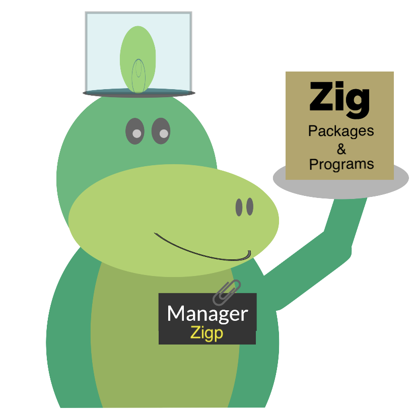

# Experimental Zig CLI package manager

<div align="center">



</div>

To install run:

```bash
curl https://raw.githubusercontent.com/zigistry/zigp/main/install_script.sh -sSf | sh
```

### What all can this do right now?

#### Adding a package to your zig project:

```bash
zigp add gh/<owner-name>/<repo-name>

# Example:
zigp add gh/capy-ui/capy
```

#### Installing a program as a binary file (This will also export it to your $PATH):

```bash
zigp install gh/<owner-name>/<repo-name>

# Example:
zigp install gh/zigtools/zls
```

#### Seeing info of a specific repository

```bash
zigp info gh/<owner-name>/<repo-name>

# Example:
zigp info gh/zigtools/zls
```
#### Self updating zigp to the latest version

```bash
zigp self-update
```

## Roadmap:

### Zig Packages:
- [x] Add
- [x] Add specific version
    - [x] Menu Driven (Choose the version to add from options)
    - [ ] Direct addition like capy-ui/capy@latest
- [x] Check Info
- [ ] Update
- [ ] Remove

### Zig applications:
- Installing:
    - [x] Specific version
        - [x] Menu Driven (Choose the version to install from options)
        - [ ] Direct addition like zigtools/zls@latest
    - [x] CLI tools (with exporting them to $PATH)
    - [ ] Complete Applications (--cask option to be implemented)
- Updating:
    - [ ] CLI tools
    - [ ] Complete Applications (--cask option to be implemented)
- Removing:
    - [ ] CLI tools
    - [ ] Complete Applications (--cask option to be implemented)

### Providers:
- [x] GitHub
- [ ] CodeBerg
- [ ] GitLab

### Operating Systems:

#### Implementation:
- [x] Macos
- [x] Linux
- [x] WSL
- [ ] Windows

### Shells:
- [x] Bash
- [x] Zsh
- [x] sh

#### Testing:
- [x] Macos
- [x] Linux
- [ ] Windows
- [ ] WSL

### Miscelanious:

- [x] Coloured output
- [x] Self update
- [x] One step installation/addition
- [ ] Proper debug/info/error messages (partially completed)
